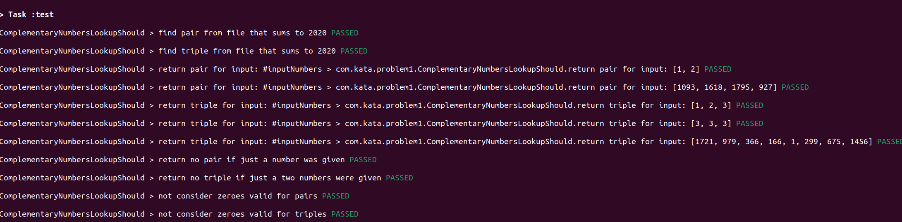

## Hiya! 👋

### Rundown 📔
So if you've got Java installed by any chance and version installed is `11+`, then, can quickly run tests with:
``./gradlew test``

Otherwise, have added a little `Dockerfile` so you don't have to install anything (still need docker though 😭)
``docker build -t  java-docker --target test . && docker run java-docker gradle test``. I changed the logging events so you can see passed, failed or skipped messages for each test after running this.

After command is finished, you should have gotten passing tests in the stdout as shown in the image below 👇

Solution for problem 1 lives in [problem1 package](./src/main/kotlin/com/kata/problem1) and its tests in the [problem1 tests package](src/test/groovy/com/kata/problem1)

Solution for problem 2 lives in [problem2 package](./src/main/kotlin/com/kata/problem2) and its tests in the [problem2 tests package](src/test/groovy/com/kata/problem2)

### Problem 1: Approach 🤔
* **A**: Iterate the input given and for each number calculate a possible complementary (= sumsTo - currentNumber 👉 2020 - 1093 = 927) and see if that's number present in the numbers fetched at that moment, if so it means we found the pair, and it gets out. Otherwise, keep the number in a set –for instant access lookup O(1)– and repeat the process for the next number.      
* **B**: For each number, calculate the maximum value a complementary number could have (sumsTo - currentNumber 👉 I.e 2020 - 1520 = 500) and then reuse pair finding code by passing sumsTo = 500, only searching a possible pair up to the current index loop is in within the input list. 
* P.S: Assumed all numbers (including `sums to`) must be positive as the input parsing would not be possible for given format.

### Problem 2: Approach 🤯
* **A**: Did a classic character index search for parsing the `c-c n: text` format, find the index of the dash, and check it's greater than 0, then find the first space index and check that it's greater than the dash index, finally lookup the colon index and check that it's greater than the first space index. From that moment on I proceed to get the min, done by applying a subsequence from 0 to dash index (exclusive), for max I do the same but starting from dash index + 1 to first space index. Then to get the letter I apply the same technique but this time starting from space index + 1 to colon index, and check through a guard clause that it's effectively only one character, finally for the text, do a substring starting from colon index + 1, guarding that first character is a whitespace. After that, I'm now able to parse input and tell if occurrences are valid.
* **B**: Same component (hence approach) is used for parsing. This time I just created another input class that considers the two numbers to be letter positions, hence validation changes. Component checks if positions are smaller or equals than the text length and then move on to check that the given positions in the string contain the input letter. 
* P.S: Assumed case was not to be ignored, plus an input like `1-1 n: text` was valid as there was no constraint indicating it.

### Side Notes ✍
* I'm used to BDD like testing so there are no tests at unit level but rather behavior oriented -> `LetterInputValidationShould` or `ComplementaryNumbersLookupShould`. Doesn't mean they are not testing exhaustively, they are, check them out! 👀
* Resolved both problems versions to also show a bit👌 my approach to adapting the code to new requirements, while keeping it simple.
* Did not introduce more semantic exceptions to not increase the coding time, but in a commercial env is definitely sth I do on daily basis. For this case Kotlin native exceptions were good enough IMO.  
* Why Groovy for testing? Is just what I'm most comfortable with, it's used at work along Spock (I could have just used Kotlin + Spock, but felt a bit unnatural and decided to focus on the solutions) and I like the testing narrative you can create with both. Hope you find them easy to read too!
* Last but not least! Sincerely thankful for the time taken to review my solution, much appreciated 🙏!
